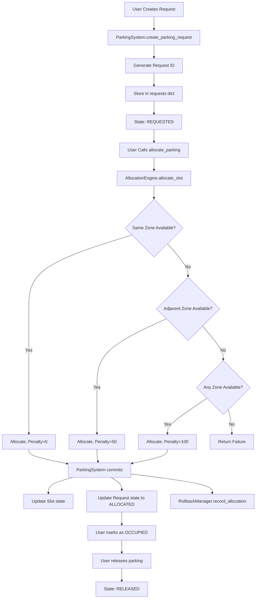

# SmartPark - Architecture Documentation

This document describes the system architecture, component interactions, data flow, and algorithmic design of SmartPark.

## Table of Contents

- [System Overview](#system-overview)
- [Architectural Patterns](#architectural-patterns)
- [Component Hierarchy](#component-hierarchy)
- [Data Flow](#data-flow)
- [Core Algorithms](#core-algorithms)
- [State Management](#state-management)
- [Allocation Strategy](#allocation-strategy)
- [Rollback Mechanism](#rollback-mechanism)
- [Analytics Pipeline](#analytics-pipeline)
- [Interface Architecture](#interface-architecture)

---

## System Overview

SmartPark is a **DSA-focused parking management system** demonstrating practical implementations of:
- **Arrays** (linear search patterns)
- **Stacks** (LIFO rollback operations)
- **Graphs** (zone adjacency for cross-zone allocation)
- **State Machines** (validated request state transitions)

### Design Philosophy

1. **Educational Focus**: Prioritizes demonstrating data structures over production optimization
2. **Pure Python**: No external dependencies except Tkinter (standard library)
3. **Explicit Complexity**: DSA choices are documented with time/space complexity
4. **Dual Interface**: Shared backend supports both CLI and GUI
5. **Immutable Operations**: All state changes recorded for rollback

---

## Architectural Patterns

### 1. Central Controller Pattern

**ParkingSystem** acts as the main orchestrator, holding all global state:

```
ParkingSystem (Controller)
├── zones: dict[zone_id → Zone]
├── vehicles: dict[vehicle_id → Vehicle]
├── requests: dict[request_id → ParkingRequest]
├── allocation_engine: AllocationEngine
├── rollback_manager: RollbackManager
└── analytics: AnalyticsEngine
```

**Benefits:**
- Single source of truth for system state
- Centralized coordination of operations
- Easy integration with both CLI and GUI

### 2. Separation of Concerns

Each module has a single responsibility:

| Module | Responsibility |
|--------|---------------|
| `parking_system.py` | Global state management, API coordination |
| `allocation_engine.py` | Slot allocation logic (NO state modification) |
| `rollback_manager.py` | Operation history and rollback |
| `analytics.py` | Metric calculation (read-only) |
| `zone.py`, `parking_area.py`, `parking_slot.py` | Hierarchical data structure |
| `parking_request.py`, `vehicle.py` | Entity models |
| `enums.py` | State machine definition |

**Critical Rule:** Only `ParkingSystem` modifies state. Engines are **stateless** and return results as dictionaries.

### 3. Dictionary-Based Communication

All public methods return dictionaries with standardized format:

```python
{
    'success': bool,      # Operation outcome
    'message': str,       # Human-readable result
    # ... additional context-specific keys
}
```

**Advantages:**
- Language-agnostic contract (easy to serialize)
- Consistent error handling
- GUI and CLI can interpret uniformly

---

## Component Hierarchy

### Storage Hierarchy

```
ParkingSystem
└── zones: dict
    └── Zone (graph node)
        ├── parking_areas: list (array)
        │   └── ParkingArea
        │       └── slots: list (array)
        │           └── ParkingSlot
        └── adjacent_zones: list (adjacency list for graph)
```

**Key Observations:**
- **Zone** is both a container (for areas) and a graph node (for adjacency)
- **Arrays** are used for slots within areas (Python lists)
- **Adjacency list** is an array of zone IDs per zone

### Processing Hierarchy

```
User Request
    ↓
ParkingSystem (validates, coordinates)
    ↓
AllocationEngine (computes allocation)
    ↓
Zone → ParkingArea → ParkingSlot (data access)
    ↓
ParkingSystem (commits state changes)
    ↓
RollbackManager (records operation)
```

**Flow Principle:** Engines **find** slots, System **commits** changes.

---

## Data Flow

### Complete Request Lifecycle



### Key Data Flows

#### 1. Allocation Flow

```
Request (REQUESTED)
    ↓
AllocationEngine (reads zones, finds slot)
    ↓
Result dict (slot_id, zone_id, penalty)
    ↓
ParkingSystem (writes to slot, updates request)
    ↓
RollbackManager (records Operation)
```

#### 2. Rollback Flow

```
RollbackManager.operation_stack (pop k operations)
    ↓
For each Operation:
    ↓
Restore slot.is_available, slot.occupied_vehicle_id
    ↓
Restore request.current_state, request.allocated_slot_id
    ↓
(State reverted to before operation)
```

#### 3. Analytics Flow

```
User requests analytics
    ↓
AnalyticsEngine (read-only access to requests dict)
    ↓
Traverse requests (array iteration)
    ↓
Accumulate metrics (counters, sums, max-finding)
    ↓
Return result dict with statistics
```

---

## Core Algorithms

### 1. Slot Allocation Algorithm

**Location:** `allocation_engine.py` → `allocate_slot()`

**Priority-Based Graph Traversal:**

```
Algorithm: Allocate Parking Slot
Input: parking_request
Output: {success, slot_id, zone_id, penalty}

1. requested_zone = parking_request.requested_zone

2. // Priority 1: Same Zone (penalty=0)
   IF requested_zone exists in zones:
       slot = requested_zone.find_available_slot()
       IF slot != None:
           ALLOCATE slot
           RETURN {success=True, penalty=0}

3. // Priority 2: Adjacent Zones (penalty=50)
   FOR each adjacent_zone_id in requested_zone.adjacent_zones:
       slot = zones[adjacent_zone_id].find_available_slot()
       IF slot != None:
           ALLOCATE slot
           RETURN {success=True, penalty=50}

4. // Priority 3: All Other Zones (penalty=100)
   FOR each zone_id in zones:
       IF zone_id != requested_zone AND zone_id NOT in adjacent_zones:
           slot = zone.find_available_slot()
           IF slot != None:
               ALLOCATE slot
               RETURN {success=True, penalty=100}

5. RETURN {success=False, message='No available slots'}
```

**Time Complexity:**
- Best case: O(m) — same-zone allocation, where m = slots in zone
- Average case: O(k×m) — adjacent zone allocation, where k = adjacent zones
- Worst case: O(n×m) — full scan, where n = total zones

**Space Complexity:** O(1) — no additional storage

### 2. Rollback Algorithm

**Location:** `rollback_manager.py` → `rollback()`

**Stack-Based LIFO Reversal:**

```
Algorithm: Rollback Operations
Input: k (number of operations), zones, requests_dict
Output: {success, rolled_back, operations_rolled_back}

1. IF k > len(operation_stack):
       RETURN error

2. rolled_back = []

3. FOR i = 1 TO k:
       operation = operation_stack.pop()  // LIFO
       
       SWITCH operation.operation_type:
           CASE 'ALLOCATE':
               slot.is_available = operation.slot_previous_availability
               request.current_state = operation.request_previous_state
               
           CASE 'CANCEL':
               slot.is_available = operation.slot_previous_availability
               request.current_state = operation.request_previous_state
               
           CASE 'OCCUPY':
               request.current_state = operation.request_previous_state
               
           CASE 'RELEASE':
               slot.is_available = operation.slot_previous_availability
               request.current_state = operation.request_previous_state
       
       rolled_back.append(operation)

4. RETURN {success=True, rolled_back, operations_rolled_back=k}
```

**Time Complexity:** O(k) — process k operations
**Space Complexity:** O(n) — stack grows with number of operations

### 3. Zone Utilization Algorithm

**Location:** `analytics.py` → `get_zone_utilization()`

**Array Traversal with Aggregation:**

```
Algorithm: Calculate Zone Utilization
Input: zones dict
Output: List of zone statistics

1. zone_stats = []

2. FOR each zone in zones:
       total_capacity = 0
       occupied_count = 0
       
       // Traverse parking areas (array)
       FOR each area in zone.parking_areas:
           total_capacity += area.capacity
           
           // Traverse slots (array)
           FOR each slot in area.slots:
               IF NOT slot.is_available:
                   occupied_count += 1
       
       utilization_rate = (occupied_count / total_capacity) * 100
       
       zone_stats.append({
           zone_id, total_capacity, occupied_count,
           available: total_capacity - occupied_count,
           utilization_rate
       })

3. SORT zone_stats by utilization_rate (descending)

4. RETURN zone_stats
```

**Time Complexity:** O(n×m + n log n)
- O(n×m) for traversal (n zones, m slots/zone)
- O(n log n) for sorting

**Space Complexity:** O(n) — store stats for n zones

### 4. Linear Slot Search

**Location:** `parking_area.py` → `find_available_slot()`

**Simple Linear Search:**

```
Algorithm: Find Available Slot
Input: slots array
Output: First available slot or None

1. FOR each slot in slots:
       IF slot.is_available == True:
           RETURN slot

2. RETURN None
```

**Time Complexity:** O(m) — worst case scan all m slots
**Space Complexity:** O(1)

**Design Note:** Binary search not used because:
- Slots are not sorted by availability (dynamic property)
- Typical zone size (10-50 slots) doesn't warrant optimization
- Educational focus on array traversal patterns

---

## State Management

### Request State Machine

**Location:** `enums.py` → `RequestState`

**Finite State Automaton:**

```
States: {REQUESTED, ALLOCATED, OCCUPIED, RELEASED, CANCELLED}

Transitions:
    REQUESTED → ALLOCATED  (allocate_parking)
    REQUESTED → CANCELLED  (cancel_request)
    ALLOCATED → OCCUPIED   (mark_parking_occupied)
    ALLOCATED → CANCELLED  (cancel_request)
    OCCUPIED  → RELEASED   (release_parking)
    RELEASED  → (terminal)
    CANCELLED → (terminal)
```

**Validation Function:**

```python
is_valid_transition(from_state, to_state) -> bool
```

**Enforcement Points:**
1. `ParkingRequest.change_state()` — validates before transition
2. `AllocationEngine` methods — check current state before operations
3. `ParkingSystem` methods — rely on validation to reject invalid ops

**Benefits:**
- Prevents impossible states (e.g., releasing a REQUESTED slot)
- Clear lifecycle for requests
- Easy to trace bugs (invalid transitions logged)

### Slot State

**Location:** `parking_slot.py` → `ParkingSlot`

**Simple Boolean State:**

```python
is_available: bool
occupied_vehicle_id: str | None
```

**State Transitions:**
- `allocate(vehicle_id)`: is_available = False
- `release()`: is_available = True, occupied_vehicle_id = None

**No Validation Needed:** Slots are simple containers; validation happens at Request level.

---

## Allocation Strategy

### Graph-Based Cross-Zone Allocation

**Concept:** Zones form an **undirected graph** where edges represent adjacency.

**Graph Representation:**

```
Zone A: adjacent_zones = ['Zone B', 'Zone C']
Zone B: adjacent_zones = ['Zone A', 'Zone D']
Zone C: adjacent_zones = ['Zone A']
Zone D: adjacent_zones = ['Zone B']
```

**Visualization:**

```
    A --- B --- D
    |
    C
```

**Allocation Traversal:**

1. **Same Zone:** Direct lookup in requested zone (no graph traversal)
2. **Adjacent Zones:** Iterate `requested_zone.adjacent_zones` (1-hop neighbors)
3. **Distant Zones:** Iterate all zones, excluding requested and adjacent

**Penalty Assignment:**

| Allocation Type | Graph Distance | Penalty |
|----------------|---------------|---------|
| Same zone | 0 hops | 0 |
| Adjacent zone | 1 hop | 50 |
| Distant zone | 2+ hops | 100 |

**Why Not Full BFS/DFS?**
- Educational focus: demonstrate adjacency lists without complex graph algorithms
- Practical: Most parking systems have shallow zone hierarchies
- Simplicity: Users understand "adjacent" vs "distant" intuitively

### Bidirectional Edges

**Function:** `link_adjacent_zones(zone1, zone2)`

**Creates Two Edges:**
```python
zones[zone1].adjacent_zones.append(zone2)
zones[zone2].adjacent_zones.append(zone1)
```

**Reason:** Adjacency is symmetric in parking contexts (if A is next to B, B is next to A).

---

## Rollback Mechanism

### Operation Recording

**Every State Modification Records:**

1. **Operation Type**: ALLOCATE, CANCEL, OCCUPY, RELEASE
2. **Slot Previous State**:
   - `slot_previous_availability` (bool)
   - `slot_previous_vehicle_id` (str | None)
3. **Request Previous State**:
   - `request_previous_state` (RequestState)
   - `request_previous_allocated_slot` (str | None)
   - `request_previous_allocated_zone` (str | None)

**Example Operation:**

```python
Operation(
    operation_type='ALLOCATE',
    slot_id='ZONE-A-A1-1',
    slot_previous_availability=True,
    slot_previous_vehicle_id=None,
    request_id='REQ0001',
    request_previous_state=RequestState.REQUESTED,
    request_previous_allocated_slot=None,
    request_previous_allocated_zone=None
)
```

### Rollback Execution

**Stack-Based Reversal (LIFO):**

```
operation_stack: [Op1, Op2, Op3, Op4]
                                  ↑
                              (top of stack)

Rollback 2 operations:
1. Pop Op4 → Restore state before Op4
2. Pop Op3 → Restore state before Op3

Result: System state as if Op3 and Op4 never happened
```

**Critical Feature:** Each operation stores **complete previous state**, enabling perfect reversal.

### Edge Cases

1. **Rollback Allocation:**
   - Slot: is_available = True (released)
   - Request: current_state = REQUESTED, allocated_slot = None

2. **Rollback Cancellation:**
   - If cancelled from ALLOCATED: restore slot and request to ALLOCATED
   - If cancelled from REQUESTED: restore to REQUESTED (no slot to restore)

3. **Request Deletion:**
   - If rolling back allocation of newly created request, delete the request entirely

---

## Analytics Pipeline

### Read-Only Data Access

**AnalyticsEngine** has reference to `ParkingSystem` but **never modifies state**.

**Pattern:**

```python
def get_metric(self):
    total = 0
    count = 0
    
    # Read-only traversal
    for request in self.parking_system.requests.values():
        if condition:
            total += value
            count += 1
    
    return calculate_result(total, count)
```

### Array Traversal Patterns

**1. Accumulation (Average Duration):**

```python
total_duration = 0
completed_count = 0

for request in requests:
    if request.state == RELEASED:
        total_duration += request.get_parking_duration()
        completed_count += 1

average = total_duration / completed_count
```

**2. Counting by State:**

```python
state_counts = {state: 0 for state in all_states}

for request in requests:
    state_counts[request.state] += 1
```

**3. Max-Finding (Peak Usage Zone):**

```python
peak_zone = None
peak_utilization = -1

for zone in zones:
    utilization = zone.occupied / zone.capacity
    if utilization > peak_utilization:
        peak_utilization = utilization
        peak_zone = zone
```

### Export Mechanism

**GUI:** Saves analytics summary to `exports/summary/` with timestamp.

**Format:**

```
exports/summary/analytics_summary_20260120_191929.txt
```

**Content:** Formatted text output from `display_analytics_summary()`.

---

## Interface Architecture

### Shared Backend

Both CLI and GUI use the **same ParkingSystem instance**:

```python
# CLI
system = ParkingSystem()
result = system.allocate_parking(request_id)
print(result['message'])

# GUI
system = ParkingSystem()
result = system.allocate_parking(request_id)
messagebox.showinfo("Success", result['message'])
```

**Benefit:** Consistent business logic regardless of interface.

### CLI Architecture

**Location:** `main.py`

**Pattern:**

```
while True:
    display_menu()
    choice = input()
    
    if choice == '1':
        add_zone(system)
    elif choice == '2':
        add_parking_area(system)
    ...
```

**Features:**
- 23 menu operations
- Emoji indicators (✅, ❌, ℹ️)
- Input validation with `.strip().upper()`
- Direct print output

### GUI Architecture

**Location:** `gui_main.py`, `ui/*.py`

**Structure:**

```
MainWindow (Tkinter root)
├── Header (title, subtitle)
└── Notebook (tabbed interface)
    ├── SetupScreen (Tab 1)
    ├── DashboardScreen (Tab 2)
    ├── RequestScreen (Tab 3)
    ├── StatusScreen (Tab 4)
    ├── RollbackScreen (Tab 5)
    └── AnalyticsScreen (Tab 6)
```

**Screen Pattern:**

```python
class ExampleScreen(tk.Frame):
    def __init__(self, parent, parking_system):
        self.parking_system = parking_system
        self.setup_ui()
    
    def setup_ui(self):
        # Create widgets (buttons, labels, inputs)
        button = tk.Button(text="Action", command=self.handle_action)
    
    def handle_action(self):
        result = self.parking_system.some_method()
        if result['success']:
            messagebox.showinfo("Success", result['message'])
        else:
            messagebox.showerror("Error", result['message'])
    
    def refresh(self):
        # Update display with latest data
```

**Key Features:**
- Tab change triggers `refresh()` on active screen
- Consistent color scheme (stored in `MainWindow.colors`)
- Modern styling via `ttk.Style`
- Message boxes for feedback

### Screen Responsibilities

| Screen | Purpose |
|--------|---------|
| SetupScreen | Add zones, areas, vehicles; link zones |
| DashboardScreen | Overview of system status (cards with stats) |
| RequestScreen | Create parking requests |
| StatusScreen | View all requests, allocate/occupy/release |
| RollbackScreen | View operation history, rollback k operations |
| AnalyticsScreen | View metrics, export analytics |

---

## Design Decisions

### Why No Database?

**Rationale:** Educational focus on **in-memory data structures**.

**Trade-offs:**
- ✅ Simple setup (no DB installation)
- ✅ Clear DSA demonstration (arrays, stacks visible in code)
- ❌ Data lost on restart (acceptable for learning project)

### Why Python Lists as Arrays?

**Rationale:** Python lists **are dynamic arrays** under the hood.

**Educational Value:**
- Demonstrates array traversal patterns (linear search, iteration)
- Shows O(n) complexity in practice
- Easy to understand for beginners

### Why Not Optimize Slot Search?

**Rationale:** Typical zone size (10-50 slots) doesn't benefit from binary search.

**Educational Trade-off:**
- ✅ Simpler code for learning
- ✅ Demonstrates linear search pattern
- ❌ Not production-grade (acceptable for academic project)

### Why Stack for Rollback?

**Rationale:** LIFO (Last-In-First-Out) matches undo semantics.

**Benefits:**
- Natural "undo last action" behavior
- O(1) push/pop operations
- Demonstrates stack data structure

### Why Graph for Zones?

**Rationale:** Real parking lots have spatial relationships.

**Educational Value:**
- Demonstrates adjacency lists
- Shows graph traversal (even if simplified)
- Practical application of graph theory

---

## Extension Points

### Adding New Features

**1. New Operation (e.g., Reserve Parking):**

```python
# In ParkingSystem
def reserve_parking(self, request_id, duration):
    # Validate request
    # Reserve slot for duration
    # Record in RollbackManager
    return {'success': True, 'message': '...'}
```

**2. New Analytics Metric:**

```python
# In AnalyticsEngine
def get_average_wait_time(self):
    # Traverse requests
    # Calculate average(allocation_time - request_time)
    return {'success': True, 'average_wait': ...}
```

**3. New UI Screen:**

```python
# In ui/new_screen.py
class NewScreen(tk.Frame):
    def __init__(self, parent, parking_system):
        self.parking_system = parking_system
        # Setup UI

# In main_window.py
new_frame = NewScreen(self.notebook, self.parking_system)
self.notebook.add(new_frame, text="🆕 New Feature")
```

### Data Structure Upgrades

**Optimize Slot Search:**

```python
# In Zone
def find_available_slot(self):
    # Maintain sorted available_slots index
    # Binary search for next available
    pass
```

**Change from O(m) to O(log m)**, but adds complexity.

**Add Heap for Priority:**

```python
# Priority queue for requests
import heapq
self.request_queue = []
heapq.heappush(self.request_queue, (priority, request))
```

Useful if implementing VIP/priority parking.

---

## Summary

**SmartPark Architecture:**

- **Central Controller** (ParkingSystem) coordinates all operations
- **Stateless Engines** (Allocation, Rollback, Analytics) for logic separation
- **Hierarchical Storage** (Zone → Area → Slot) as graph + arrays
- **Dictionary Communication** for consistent API
- **State Machine** enforces request lifecycle
- **Stack-Based Rollback** for operation reversal
- **Dual Interface** (CLI + GUI) with shared backend

**Key Characteristics:**

- Educational DSA focus over production optimization
- Pure Python with no external dependencies
- Explicit complexity documentation
- Immutable operations (all changes recorded)
- Extensible design for adding features

---

**For data structure details, see [DSA_CONCEPTS.md](DSA_CONCEPTS.md)**  
**For API reference, see [API.md](API.md)**  
**For user instructions, see [USER_GUIDE.md](USER_GUIDE.md)**
